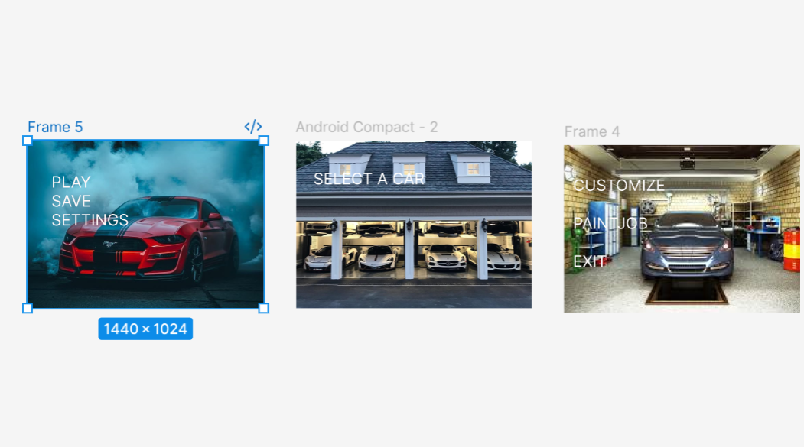

# Ex09 Event Registration Web Application
## Date:

## AIM:
To design, develop and deploy a web application for event registration.

## DESIGN STEPS:

### Step 1:
Create a new frame.

### Step 2:
Select any one preset size of your choice.

### Step 3:
Select the shapes you need.

### Step 4:
Import images as needed.

### Step 5:
Create pages based on your need and link them.

### Step 6:

Validate the HTML and CSS code.

### Step 6:

Publish the website in the given URL.

## DESIGN TOOL:
Figma

## CODE:
```
start.html
<!DOCTYPE html>
<html>
  <head>
    <meta name="viewport" content="width=device-width, initial-scale=1" />
    <meta charset="utf-8" />
    <link rel="stylesheet" href="globals.css" />
    <link rel="stylesheet" href="style.css" />
  </head>
  <body>
    <div class="frame">
      <div class="div-wrapper">
        <div class="div-wrapper">
          <div class="android-compact">
            
            
            <div class="PLAY-SAVE-SETTINGS">PLAY<br />SAVE<br />SETTINGS</div>
          </div>
        </div>
      </div>
    </div>
  </body>
</html>

stlye.css
.frame {
  width: 100%;
  min-width: 1440px;
  min-height: 1024px;
  display: flex;
}

.frame .div-wrapper {
  width: 1440px;
  display: flex;
}

.frame .android-compact {
  width: 1440px;
  height: 1024px;
  position: relative;
  background-color: #ffffff;
  overflow: hidden;
}

.frame .car {
  position: absolute;
  top: 0;
  left: 0;
  width: 1440px;
  height: 1024px;
  aspect-ratio: 1.5;
  object-fit: cover;
}

.frame .text-on-a-path {
  position: absolute;
  top: 695px;
  left: 3892px;
  width: 552px;
  height: 62px;
}

.frame .PLAY-SAVE-SETTINGS {
  position: absolute;
  top: 194px;
  left: 146px;
  width: 529px;
  font-family: "Inter-Regular", Helvetica;
  font-weight: 400;
  color: #fff7f7;
  font-size: 96px;
  letter-spacing: 0;
  line-height: normal;
}

select.html
<!DOCTYPE html>
<html>
  <head>
    <meta name="viewport" content="width=device-width, initial-scale=1" />
    <meta charset="utf-8" />
    <link rel="stylesheet" href="globals.css" />
    <link rel="stylesheet" href="style.css" />
  </head>
  <body>
    <div class="frame"></div>
  </body>
</html>

style.css
.frame {
  width: 1437px;
  height: 1080px;
  display: flex;
}

.frame .car-se {
  margin-top: 28px;
  width: 1437px;
  height: 1024px;
  aspect-ratio: 1.33;
}

customize.html
<!DOCTYPE html>
<html>
  <head>
    <meta name="viewport" content="width=device-width, initial-scale=1" />
    <meta charset="utf-8" />
    <link rel="stylesheet" href="globals.css" />
    <link rel="stylesheet" href="style.css" />
  </head>
  <body>
    <div class="frame">
      <div class="android-compact">
        
        <div class="CUSTOMIZE-PAINTJOB">CUSTOMIZE<br /><br />PAINTJOB<br /><br />EXIT</div>
      </div>
    </div>
  </body>
</html>

style.css
.frame {
  width: 100%;
  min-width: 1440px;
  min-height: 1024px;
  display: flex;
}

.frame .android-compact {
  width: 1440px;
  height: 1024px;
  position: relative;
  background-color: #ffffff;
}

.frame .images {
  position: absolute;
  top: 0;
  left: 0;
  width: 1440px;
  height: 1024px;
  aspect-ratio: 1.34;
  object-fit: cover;
}

.frame .CUSTOMIZE-PAINTJOB {
  position: absolute;
  top: 187px;
  left: 55px;
  width: 622px;
  font-family: "Inter-Regular", Helvetica;
  font-weight: 400;
  color: #faf9f9;
  font-size: 96px;
  letter-spacing: 0;
  line-height: normal;
}
```
## OUTPUT:


## RESULT:
The program to design, develop and deploy a web application for event registration is completed successfully.
